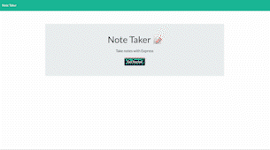

# Note Taker


## Technology Used 

| Technology Used         | Resource URL           | 
| ------------- |:-------------:| 
| HTML    | [developer.mozilla.org](https://developer.mozilla.org/en-US/docs/Web/HTML) |      |   
| Git | [git-scm.com](https://git-scm.com/)     |    
| Node.js | [nodejs.org/docs](https://nodejs.org/docs/latest-v16.x/api/) |
| Heroku | [devcenter.heroku.com](https://devcenter.heroku.com/categories/reference)
| Express.js | [expressjs.com](https://expressjs.com/en/guide/routing.html)


## Description

[Visit the Deployed Site](https://sleepy-shore-79975.herokuapp.com/)
    
This project is a note application. When a user opens the application, they are presented with a hoempage with a begin button. When they click the begin button, they are lead to a page with their previous notes on the left-hand side and an option to create new notes on the right-hand side. When a user enters in a title and text, then a save button appears in the upper-right corner. When the save button is clicked, the note is added to the other saved notes on the left-hand side. There is also a trash icon on the note that allows a user to delete a note as well.

This project was created using Node.js and deployed with Heroku.

I created this project to gain exerience with Express.js and Heroku. This project helped me to understand the relationship between the frontend and the backend and how those two communicate with each other.



  ## Table of Contents
- [Code Example](#code-example)
- [Usage](#usage)
- [Author Info](#author-info)
- [Credits](#credits)
- [License](#license)

## Code Example

```
api.delete('/notes/:id', (req, res) => {
    if (req.params.id) {
        console.info(`${req.method} request received to remove a note`);
        let notes = fs.readFileSync('./db/db.json', 'utf8');
        notes = JSON.parse(notes);
        const id = req.params.id;
        let noteString = notes.filter(note => note.id !== id)
        let newNoteString = JSON.stringify(noteString);
        console.log(noteString);
        const updatedVersion = fs.writeFile('./db/db.json', newNoteString, (err) =>
            err ? console.error(err) : console.log('Note has been removed.'));
        res.send(updatedVersion);
    } else {
        res.status(400).send('Note ID not provided');
    }
})
```

As a bonus, I created a route to delete a note. In the route path, I specified the id parameter, which was created and applied to each note in the post route. Then, I created a variable for the value of the db.json file and the request parameter id. 

After this, I filtered through the variable object of the contents of the db.json file and added any objects that do not have an id that match the parameter to the variable noteString. Essentially, this creates a new array of objects that does not contain the object selected. Then, I stringified this value and updated the file with this new value. At the end, I sent this updated version back to the user making the delete request to update the page. 

## Usage
  
This project can be used for saving and referrencing notes.

## Author Info

### Megan Ellman

[LinkedIn](https://www.linkedin.com/in/megan-ellman/)

[GitHub](https://github.com/megellman)

[Portfolio](https://megellman.github.io/portfolio/)
    
## Credits
    
- [Heroku](https://devcenter.heroku.com/categories/reference)
- [Node.js](https://nodejs.org/docs/latest-v16.x/api/)
    
## License
  
  This project is covered under the MIT license. For more information please click [here](https://choosealicense.com/)

## Questions

[GitHub](github.com/megellman)

If you have any additional questions, you can reach me at meganlellman@gmail.com